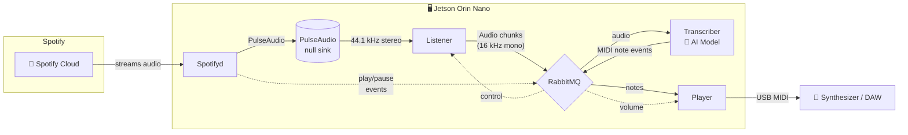

# 🎹 PianoSpeaker

Cast any Spotify song to your acoustic piano — it plays itself, in real-time.
No human hands. No recordings. Just AI listening and the keys moving.

[](LICENSE)
[](https://www.nvidia.com/en-us/autonomous-machines/embedded-systems/jetson-orin/)

---

## Demo

Watch a Steinway Spirio play a Spotify song in real-time — with no human hands on the keys:

[](https://www.reddit.com/r/piano/comments/1krxhdy/we_made_a_selfplaying_piano_stream_songs_directly/)

---

## What is PianoSpeaker?

PianoSpeaker turns your self-playing acoustic piano into a Spotify speaker. Open Spotify on your phone, select "PianoSpeaker" as your playback device (it shows up just like a Bluetooth speaker), and play any piano piece — the real piano keys move on their own, playing the music back acoustically.

Setup is a one-time thing: plug in the device, connect it to your WiFi once through a captive portal, and you're done. From that point on it just works — power it on, cast from Spotify, hear your piano play.

The AI model is trained specifically for solo piano music, so it works best with clean piano recordings. Songs with vocals, drums, or other instruments mixed in will produce poor results.

---

## How It Works

1. You open Spotify and cast to "PianoSpeaker" — it appears as a playback device, like a Bluetooth speaker.
2. A small AI computer (NVIDIA Jetson Orin Nano) receives the audio stream.
3. An AI model listens to the audio and identifies the piano notes in real-time.
4. Those notes are sent to your physical piano via MIDI — with sub-second latency.
5. The piano plays itself.

---

## Who Is This For?

- **Piano owners** with a self-playing instrument — Steinway Spirio, Yamaha Disklavier, or any MIDI-compatible player piano with a DIN-5 MIDI input.
- **Makers and hobbyists** interested in real-time AI audio on edge hardware.
- **Developers** exploring AI inference pipelines on NVIDIA Jetson or real-time audio processing.

---

## Hardware Requirements

Here's what you need to build your own PianoSpeaker:

| Component | Details |
|---|---|
| **Board** | [Seeed Studio reComputer J3011](https://www.seeedstudio.com/reComputer-J3011-p-5590.html) (Jetson Orin Nano 8GB) |
| **JetPack** | 5.1.1 (L4T 35.3.1) |
| **Audio input** | Virtual — PulseAudio null sink captures Spotifyd output (no physical mic needed) |
| **MIDI output** | USB MIDI interface connected to a synthesizer or DAW |
| **Network** | WiFi or Ethernet (required for Spotify; WiFi portal is provided) |

> **⚠️ Kernel Rebuild Required:** The Jetson J3011 from Seeed Studios does not support USB MIDI out of the box. You must rebuild the Jetson kernel to enable MIDI device drivers. See [this guide (Japanese)](https://qiita.com/kitazaki/items/b1870b8836dc369f8ae8) for a step-by-step walkthrough of recompiling the kernel with USB MIDI support on JetPack 5.1.1. The official [NVIDIA Jetson Linux Developer Guide](https://docs.nvidia.com/jetson/archives/r35.3.1/DeveloperGuide/text/SD/Kernel/KernelCustomization.html) covers general kernel customization.

---

## Getting Started

The install script handles everything. These steps take about 10–15 minutes on a fresh Jetson.

### Prerequisites

- Seeed Studio reComputer J3011 (or compatible Jetson Orin Nano)
- JetPack 5.1.1 flashed and booted
- Internet connection on the Jetson
- USB MIDI interface connected to your synthesizer
- AI model weights (`combined.pth`) — see [Model Setup](#model-setup)

### Steps

1. **Clone the repository** on your Jetson:

   ```bash
   git clone https://github.com/Niekvdplas/streaming-piano-oss.git
   cd streaming-piano-oss
   ```

2. **Run the install script:**

   ```bash
   sudo ./scripts/install_script.sh
   ```

   This will install:
   - RabbitMQ + Erlang
   - PulseAudio null sink for Spotify
   - PyTorch (NVIDIA JetPack 5.x wheel)
   - Python dependencies from `requirements.txt`
   - System packages (PyAudio, BLAS, LAPACK, ALSA, etc.)
   - All systemd services

3. **Reboot:**

   ```bash
   sudo reboot
   ```

   All services start automatically on boot. On first run, the transcription model checkpoint will be downloaded automatically by `piano_transcription_inference`.

### Environment Variables

| Variable | Default | Description |
|---|---|---|
| `MIDI_DEVICE_INDEX` | `1` | Index of the MIDI output device (see `python3 -c "import mido; print(mido.get_output_names())"`) |

---

## Usage

### What You Need

- **A self-playing piano** — any piano with a built-in player system that accepts MIDI input via a DIN-5 connector. We used a [Steinway Spirio](https://www.steinway.com/spirio), but any piano with a MIDI-in port on its control board will work.
- **A USB-to-DIN5 MIDI cable** — plug the USB side into the Jetson and the DIN-5 side into the MIDI input port on your piano.
- **A WiFi network** — the Jetson needs internet access to stream from Spotify.

### First Boot & WiFi Setup

1. Power on the Jetson. On first boot (or when it can't find a known network), it will **create its own WiFi hotspot** called `PianoSpeaker`.
2. Connect to the `PianoSpeaker` network from your phone or laptop.
3. A captive portal will appear — select your home WiFi network, enter the password, and the Jetson will connect to it.
4. The Jetson will remember your network for future boots.

### Playing Music

1. Open **Spotify** on your phone, tablet, or computer.
2. Look for **PianoSpeaker** in your available devices / cast speakers.
3. Select it and play any piano music — the notes will be transcribed in real-time and played on your physical piano.

That's it. It's truly a black-box experience: plug it in, connect to WiFi once, and cast piano music to your acoustic piano from Spotify.

> **⚠️ Spotify only:** At the moment, only Spotify is supported as a music source. The system uses Spotifyd under the hood, which requires a Spotify account.

---

## Architecture

For developers and curious readers, here's how the components fit together under the hood.



Spotifyd streams piano music from Spotify into a PulseAudio null sink (`spotifySink`). The Listener captures audio from that virtual device, resamples it, and feeds it to the Transcriber for AI-based note recognition. The resulting MIDI events are sent to a physical synthesizer via the Player.

### Components

| File | Purpose |
|---|---|
| `listener.py` | Captures audio from the PulseAudio null sink (Spotifyd output) at 44.1 kHz stereo, resamples to 16 kHz mono, and publishes chunks to RabbitMQ. Starts/stops recording based on Spotify playback events. |
| `transcriber.py` | Consumes audio chunks, runs them through the [piano-transcription-inference](https://github.com/qiuqiangkong/piano_transcription_inference) AI model, and publishes detected MIDI note/pedal events. |
| `player.py` | Receives MIDI events and sends them to a hardware MIDI output device. Includes dynamic volume scaling and soft-knee compression. |
| `spotifyd` | Pre-built ARM64 [Spotifyd](https://github.com/Spotifyd/spotifyd) binary for streaming Spotify. |
| `scripts/spotify.sh` | Launches the Spotifyd daemon with PulseAudio backend. |
| `scripts/pubshell.sh` | Publishes Spotify playback events (play/pause/volume) to RabbitMQ. |
| `scripts/check_internet.sh` | Checks internet connectivity; launches a WiFi captive portal if offline. |
| `wifi/` | [Balena WiFi Connect](https://github.com/balena-os/wifi-connect) binary and web UI for network provisioning. |
| `services/` | Systemd unit files for all services (see [Services](#systemd-services) below). |

### Message Flow

All inter-process communication uses **RabbitMQ** running on `localhost`:

- **`Audio chunks`** queue — raw numpy arrays (16 kHz float32) from Listener → Transcriber
- **`PianoSpeaker`** exchange with routing keys:
  - `Note events` — serialized MIDI messages from Transcriber → Player
  - `Volume events` — integer volume level from Spotify → Player
- **`spotifyd`** queue — play/pause/stop commands from Spotify → Listener

---

## Systemd Services

After installation, the following services are enabled:

| Service | Description |
|---|---|
| `listener.service` | Audio capture and publishing |
| `transcriber.service` | AI model inference |
| `player.service` | MIDI output to synthesizer |
| `spotifyd.service` | Spotify playback daemon |
| `pulseaudio.service` | System-wide PulseAudio server |
| `internet_conn.service` | Network check + WiFi portal fallback |

Manage services with standard systemd commands:

```bash
sudo systemctl status listener.service
sudo systemctl restart transcriber.service
journalctl -u player.service -f    # follow logs
```

---

## Development

To run components individually for debugging:

```bash
# Make sure RabbitMQ is running
sudo systemctl start rabbitmq-server

# Run each component in separate terminals
python3 listener.py
python3 transcriber.py
python3 player.py
```

---

## Help & Support

If you have trouble setting up the system or have any questions, feel free to [open an issue](../../issues) on this repository.

---

## License

This project is licensed under the [MIT License](LICENSE).
