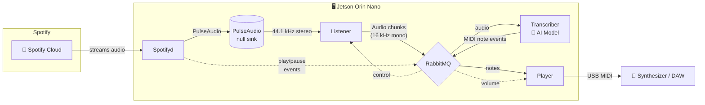

# 🎹 Streaming Piano

Real-time piano transcription system that listens to Spotify playback via a virtual microphone (PulseAudio null sink), uses an AI model to recognize piano notes, and outputs MIDI to a hardware synthesizer — all with sub-second latency.

> **Note:** The transcription model is trained specifically for solo piano music. It works best with clean piano recordings and will produce poor results with vocals, drums, or other instruments mixed in.

## Architecture



Spotifyd streams piano music from Spotify into a PulseAudio null sink (`spotifySink`). The Listener captures audio from that virtual device, resamples it, and feeds it to the Transcriber for AI-based note recognition. The resulting MIDI events are sent to a physical synthesizer via the Player.

### Components

| File | Purpose |
|---|---|
| `listener.py` | Captures audio from the PulseAudio null sink (Spotifyd output) at 44.1 kHz stereo, resamples to 16 kHz mono, and publishes chunks to RabbitMQ. Starts/stops recording based on Spotify playback events. |
| `transcriber.py` | Consumes audio chunks, runs them through the [piano-transcription-inference](https://github.com/qiuqiangkong/piano_transcription_inference) AI model, and publishes detected MIDI note/pedal events. |
| `player.py` | Receives MIDI events and sends them to a hardware MIDI output device. Includes dynamic volume scaling and soft-knee compression. |
| `spotifyd` | Pre-built ARM64 [Spotifyd](https://github.com/Spotifyd/spotifyd) binary for streaming Spotify. |
| `scripts/spotify.sh` | Launches the Spotifyd daemon with PulseAudio backend. |
| `scripts/pubshell.sh` | Publishes Spotify playback events (play/pause/volume) to RabbitMQ. |
| `scripts/check_internet.sh` | Checks internet connectivity; launches a WiFi captive portal if offline. |
| `wifi/` | [Balena WiFi Connect](https://github.com/balena-os/wifi-connect) binary and web UI for network provisioning. |
| `services/` | Systemd unit files for all services (see [Services](#systemd-services) below). |

### Message Flow

All inter-process communication uses **RabbitMQ** running on `localhost`:

- **`Audio chunks`** queue — raw numpy arrays (16 kHz float32) from Listener → Transcriber
- **`PianoSpeaker`** exchange with routing keys:
  - `Note events` — serialized MIDI messages from Transcriber → Player
  - `Volume events` — integer volume level from Spotify → Player
- **`spotifyd`** queue — play/pause/stop commands from Spotify → Listener

## Hardware Requirements

This project is designed for the **Seeed Studio reComputer J3011** (NVIDIA Jetson Orin Nano 8GB).

| Component | Details |
|---|---|
| **Board** | [Seeed Studio reComputer J3011](https://www.seeedstudio.com/reComputer-J3011-p-5590.html) (Jetson Orin Nano) |
| **JetPack** | 5.1.1 (L4T 35.3.1) |
| **Audio input** | Virtual — PulseAudio null sink captures Spotifyd output (no physical mic needed) |
| **MIDI output** | USB MIDI interface connected to a synthesizer or DAW |
| **Network** | WiFi or Ethernet (required for Spotify; WiFi portal is provided) |

> **⚠️ Kernel Rebuild Required:** The Jetson J3011 from Seeed Studios does not support USB MIDI out of the box. You must rebuild the Jetson kernel to enable MIDI device drivers. See [this guide (Japanese)](https://qiita.com/kitazaki/items/b1870b8836dc369f8ae8) for a step-by-step walkthrough of recompiling the kernel with USB MIDI support on JetPack 5.1.1. The official [NVIDIA Jetson Linux Developer Guide](https://docs.nvidia.com/jetson/archives/r35.3.1/DeveloperGuide/text/SD/Kernel/KernelCustomization.html) covers general kernel customization.

## Installation

### Prerequisites

- Seeed Studio reComputer J3011 (or compatible Jetson Orin Nano)
- JetPack 5.1.1 flashed and booted
- Internet connection on the Jetson
- USB MIDI interface connected to your synthesizer
- AI model weights (`combined.pth`) — see [Model Setup](#model-setup)

### Steps

1. **Clone the repository** on your Jetson:

   ```bash
   git clone https://github.com/YOUR_USERNAME/streaming-piano.git
   cd streaming-piano
   ```

2. **Run the install script:**

   ```bash
   sudo ./scripts/install_script.sh
   ```

   This will install:
   - RabbitMQ + Erlang
   - PulseAudio null sink for Spotify
   - PyTorch (NVIDIA JetPack 5.x wheel)
   - Python dependencies from `requirements.txt`
   - System packages (PyAudio, BLAS, LAPACK, ALSA, etc.)
   - All systemd services

3. **Reboot:**

   ```bash
   sudo reboot
   ```

   All services start automatically on boot. On first run, the transcription model checkpoint will be downloaded automatically by `piano_transcription_inference`.

### Environment Variables

| Variable | Default | Description |
|---|---|---|
| `MIDI_DEVICE_INDEX` | `1` | Index of the MIDI output device (see `python3 -c "import mido; print(mido.get_output_names())"`) |

## Systemd Services

After installation, the following services are enabled:

| Service | Description |
|---|---|
| `listener.service` | Audio capture and publishing |
| `transcriber.service` | AI model inference |
| `player.service` | MIDI output to synthesizer |
| `spotifyd.service` | Spotify playback daemon |
| `pulseaudio.service` | System-wide PulseAudio server |
| `internet_conn.service` | Network check + WiFi portal fallback |

Manage services with standard systemd commands:

```bash
sudo systemctl status listener.service
sudo systemctl restart transcriber.service
journalctl -u player.service -f    # follow logs
```

## Development

To run components individually for debugging:

```bash
# Make sure RabbitMQ is running
sudo systemctl start rabbitmq-server

# Run each component in separate terminals
python3 listener.py
python3 transcriber.py
python3 player.py
```

## License

This project is licensed under the [MIT License](LICENSE).
